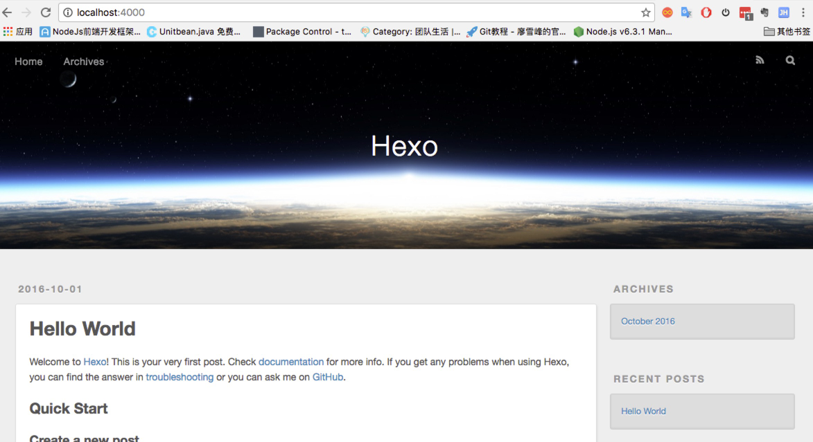

#基于hexo+github搭建一个独立博客

------

    一直听说用 **hexo** 搭建一个拥有自己域名的博客是很酷炫的事情~，在这十一花上半个小时整个hexo博客岂不美哉。
    使用Hexo吸引我的是，其简单优雅, 而且风格多变, 适合程序员搭建个人博客,而且支持多平台的搭建，再加上有些node,git基础，分分钟创建出一个高大上的博客。废话少说，开始吧。

> **准备工作**

 * node：用来生成静态页面的 到Node.js官网下载相应平台的最新版本，一路安装即可。
 * git: 把本地的hexo内容提交到github上去.没有安装的可以看此教程。
 * github：用来做博客的远程创库、域名、服务器。（~不多说了）
    然后你还要知道一点点linux命令，域名解析相关知识（以上条件你都达到了，那么恭喜你30分钟搭建倒计时开始~）

> **安装Hexo**

（本人是Mac系统，其他系统的朋友这部分可以看官网教程）
当Node.js和Git都安装好后就可以正式安装Hexo了，终端执行如下命令：

    sudo npm install -g hexo

输入管理员密码即开始安装

> **初始化**

 终端cd到一个你选定的目录（比如创建一个blog文件，$cd blog），执行hexo init命令：

    hexo init

在blog目录下，执行如下命令，安装npm：

    npm install

执行如下命令，开启hexo服务器：

    hexo s

此时，浏览器中打开网址http://localhost:4000，能看到如下页面：

本地设置好后，接下来开始关联Github。

> **创建仓库**
